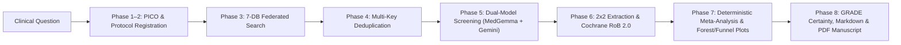

# 🩺 SRMA Agent — Autonomous Systematic Review & Meta-Analysis Clinical Portal

[](#)
[](#)
[](#)
[](#)
[](#)

**SRMA Agent** is an end-to-end **Autonomous Systematic Review and Meta-Analysis (SRMA)** clinical evidence synthesis platform built with **Google ADK**, **Gemini**, and **Local MedGemma (4B)** via **Ollama**.

Given any natural-language clinical research question, the agent autonomously executes an **8-phase evidence synthesis pipeline**—from PICO protocol registration and federated 7-database search to dual-reviewer abstract screening, structured 2×2 trial data extraction, Cochrane Risk of Bias 2.0 assessment, deterministic random-effects meta-analysis, forest/funnel plot generation, GRADE certainty grading, and publication-ready PDF manuscript compilation.

---

## ✨ Key Capabilities

* **Hybrid Dual-Model Clinical Reasoning (Gemini + MedGemma):**
  * **Reviewer 1 (Recall-Focused):** Local **MedGemma (`medgemma-4b`)** screens titles/abstracts for biomedical sensitivity, extracts two-arm outcome counts, and assesses Cochrane RoB 2.0 domains.
  * **Reviewer 2 (Precision-Focused):** **Google Gemini** independently screens every record against strict PICOS criteria, arbitrates screening disagreements, and synthesizes the final narrative and GRADE tables.
* **Federated 7-Database Literature Search:**
  * Queries **PubMed (NCBI E-utilities)**, **Europe PMC**, **ClinicalTrials.gov (API v2)**, **OpenAlex**, **Crossref**, **Semantic Scholar**, and **medRxiv / bioRxiv Preprints** concurrently using native dialect query compilers.
* **Deterministic Statistical Meta-Analysis (Zero LLM Math Hallucination):**
  * All statistical computations are performed deterministically in Python (`numpy` / `scipy`):
  * **Effect Measures:** Risk Ratio (`RR`), Odds Ratio (`OR`), Risk Difference (`RD`), Mean Difference (`MD`), Standardized Mean Difference (`SMD` / Hedges' $g$).
  * **Pooling Estimators:** DerSimonian-Laird ($\tau^2_{\text{DL}}$), Restricted Maximum Likelihood + Hartung-Knapp-Sidik-Jonkman (`REML + HKSJ`), Paule-Mandel ($\tau^2_{\text{PM}}$), and Fixed-Effect Inverse Variance.
  * **Heterogeneity & Bias:** Cochran's $Q$, $I^2$, $H^2$, 95% Prediction Intervals, Egger's regression test, Begg's rank correlation test, and Leave-One-Out sensitivity analysis.
* **Complete Mathematical & PRISMA 2020 Audit Transparency:**
  * Every single retrieved article is accounted for with clickable `PMID ↗`, `DOI ↗`, and `NCT ↗` verification badges across:
    * **Table 1 (`Included Studies`)** (`Pooled in Meta-Analysis` + `Approved Unpooled` with exact reason codes such as `MISSING_BINARY_DATA` or `EVENTS_EXCEED_TOTAL`).
    * **Tab 4 (`Excluded & Duplicates Audit Log`)** (`Excluded Articles`, `Approved Unpooled`, and `Removed Duplicates`).
* **Interactive Clinical Portal UI + 1-Click PDF Manuscript:**
  * Clean **Chatbot Mode** for asking clinical questions with real-time Server-Sent Events (SSE) phase tracking.
  * **4-Tab Full Analysis Dashboard** + downloadable **PDF Manuscript (`manuscript.pdf`)** and **Markdown Report (`report.md`)**.

---

## 🏗️ 8-Phase Pipeline Architecture



---

## 🚀 Quick Start — Clone & Run Locally

### 1. Prerequisites
* **Python 3.10+**
* **Google AI Studio API Key (`GOOGLE_API_KEY`)** — Get a free key at [https://aistudio.google.com/apikey](https://aistudio.google.com/apikey)
* **Ollama** *(Recommended for local MedGemma dual-reviewer screening)* — Install from [https://ollama.com](https://ollama.com)
* **Node.js 18+** *(Optional — `ui/dist` is already pre-built and ready to serve out of the box!)*

---

### 2. Clone the Repository & Install Python Dependencies

```bash
git clone https://github.com/omtrivedioo3/SRMA_Agent.git
cd SRMA_Agent

# Create and activate a Python virtual environment
python3 -m venv .venv
source .venv/bin/activate

# Install all required Python packages
pip install --upgrade pip
pip install -r requirements.txt
```

---

### 3. Configure Environment Variables (`.env`)

Copy the provided `.env.example` template to `.env` and add your `GOOGLE_API_KEY`:

```bash
cp .env.example .env
```

Edit `.env`:
```env
# REQUIRED: Gemini API key from https://aistudio.google.com/apikey
GOOGLE_API_KEY=your_gemini_api_key_here

# OPTIONAL: Hugging Face token (only needed if downloading MedGemma GGUF weights)
HF_TOKEN=your_hf_token_here

# OPTIONAL: Raises PubMed rate limit from 3 to 10 req/sec
NCBI_API_KEY=

# OPTIONAL: Polite contact email for OpenAlex & Crossref
SRMA_CONTACT_EMAIL=your_email@example.com

# Default screening & per-database caps (optimized for fast local CPU execution)
SRMA_MAX_ABSTRACTS_TO_SCREEN=20
SRMA_MAX_RECORDS_PER_SOURCE=25
```

---

### 4. Set Up Local MedGemma (`medgemma-4b`) via Ollama *(Optional but Recommended)*

If you want full dual-model screening (MedGemma + Gemini), download the quantized MedGemma GGUF model and register it in Ollama:

```bash
# 1. Download MedGemma-4B-IT Q4_K_M GGUF into ./models/
python scripts/download_medgemma.py

# 2. Create the medgemma-4b model in Ollama
ollama create medgemma-4b -f models/Modelfile

# 3. Verify Ollama has medgemma-4b ready
ollama list
```
> **Note:** If Ollama is not running, the pipeline gracefully falls back to Gemini so you can still run full reviews immediately.

---

### 5. Launch the SRMA Clinical Evidence Portal (`http://localhost:8090`)

You can start the web portal using the helper script or directly with `uvicorn`:

```bash
# Option A: Using the startup script (automatically builds UI if needed and starts FastAPI)
chmod +x scripts/start_portal.sh
./scripts/start_portal.sh

# Option B: Start FastAPI directly (since ui/dist is already pre-built)
.venv/bin/uvicorn srma_agent.web_server:app --host 0.0.0.0 --port 8090
```

Now open your browser at:
👉 **[http://localhost:8090](http://localhost:8090)**

---

## 🖥️ Using the Clinical Evidence Portal

1. **Chatbot View (Default):**
   * Click **`＋ New Clinical Query`** in the top-left sidebar.
   * Select any of the built-in **Clinical Presets** (e.g., *GLP-1 RA in Type 2 Diabetes*, *DOACs vs Warfarin in Atrial Fibrillation*, *Aspirin Primary CV Prevention*, *Corticosteroids in Severe COVID-19*) or type your own clinical question and press **Enter**.
   * Watch real-time progress across all 8 phases.
   * Review the **Clinical Conclusion**, **4 clickable KPI cards**, **Forest & Funnel Plots**, and direct **`📄 Full Text Report (.md) ↗`** / **`📕 Full PDF Manuscript ↗`** buttons.
2. **Full Analysis View (`📊 View Full Analysis & Tables`):**
   * **Tab 1 — `Abstract, PICO & PRISMA Flow`:** Structured executive abstract, PICOS eligibility table, and visual PRISMA 2020 flow diagram.
   * **Tab 2 — `Included Studies & Risk of Bias`:** Table 1 with study-level two-arm counts, effect estimates, pooling status/reasons, clickable source links, and Cochrane RoB 2.0 traffic-light matrix.
   * **Tab 3 — `Meta-Analysis, Plots & GRADE`:** High-resolution Forest Plot, Funnel Plot, and GRADE Summary of Findings table.
   * **Tab 4 — `Excluded & Duplicates Audit Log`:** Complete transparency log separated into `Excluded Articles`, `Approved Unpooled`, and `Removed Duplicates`, each with direct verification links.

---

## 🛠️ Optional: Frontend UI Development (`ui/`)

The production React bundle in `ui/dist/` is pre-compiled and served automatically by FastAPI on port `8090`. If you modify `ui/src/App.jsx` or `ui/src/styles.css`:

```bash
cd ui
npm install

# Build production bundle into ui/dist/
npm run build

# Or run Vite dev server with hot-reload on http://localhost:5173 (proxies /api to :8090)
npm run dev
```

---

## 🧪 CLI & Diagnostic Scripts

You can also run the pipeline or verify individual subsystems directly from the terminal:

```bash
# Run a full Systematic Review & Meta-Analysis from the CLI
.venv/bin/python scripts/run_review.py \
  "Does low-dose aspirin compared to placebo reduce major adverse cardiovascular events in adults without established cardiovascular disease?"

# Test all 7 literature database connectors
.venv/bin/python scripts/test_sources.py

# Test the deterministic meta-analysis engine & plot generation
.venv/bin/python scripts/test_meta_analysis.py

# Test dual-reviewer abstract screening
.venv/bin/python scripts/test_screening.py

# Launch Google ADK Developer Web UI
.venv/bin/adk web .
```

---

## 📂 Project Structure

```text
SRMA_Agent/
├── srma_agent/                 # Core Python Package
│   ├── agent.py                # Google ADK root_agent definition
│   ├── config.py               # Environment & model configuration
│   ├── pipeline.py             # End-to-end 8-phase deterministic + LLM orchestrator
│   ├── prompts.py              # Clinical prompts for PICO, screening, extraction, RoB 2.0 & GRADE
│   ├── schemas.py              # Pydantic & dataclass schemas (PICOS, StudyRecord, PRISMA)
│   ├── web_server.py           # FastAPI backend + SSE streaming + normalized REST API
│   └── tools/                  # Modular Evidence Synthesis Tools
│       ├── pubmed.py           # PubMed NCBI E-utilities connector
│       ├── europepmc.py        # Europe PMC REST connector
│       ├── clinicaltrials.py   # ClinicalTrials.gov API v2 connector
│       ├── openalex.py         # OpenAlex scholarly connector
│       ├── crossref.py         # Crossref DOI metadata connector
│       ├── semantic_scholar.py # Semantic Scholar connector
│       ├── preprints.py        # medRxiv / bioRxiv preprint connector
│       ├── query.py            # Dialect-aware Boolean & MeSH query compiler
│       ├── dedupe.py           # Multi-key deterministic deduplication (DOI/PMID/NCT/Title)
│       ├── screening.py        # Dual-reviewer (MedGemma + Gemini) screening & arbitration
│       ├── extraction.py       # Structured 2x2 / continuous data extraction & RoB 2.0
│       ├── meta_analysis.py    # Deterministic numpy/scipy pooling, heterogeneity & bias tests
│       ├── plots.py            # Publication-quality Matplotlib Forest & Funnel plots
│       └── pdf_report.py       # ReportLab academic PDF manuscript generator
├── ui/                         # React 18 + Vite Clinical Evidence Portal
│   ├── src/
│   │   ├── App.jsx             # Chat View + 4-Tab Full Analysis Dashboard
│   │   └── styles.css          # Clinical styling & layout
│   ├── dist/                   # Pre-built static bundle served by FastAPI
│   ├── package.json
│   └── vite.config.js
├── scripts/                    # CLI runners, startup scripts, and unit tests
│   ├── start_portal.sh         # One-command portal launcher
│   ├── run_review.py           # CLI review runner
│   └── download_medgemma.py    # Hugging Face MedGemma GGUF downloader
├── runs/                       # Saved review runs (result.json, report.md, manuscript.pdf, plots)
├── requirements.txt            # Python dependencies
└── .env.example                # Environment variable template
```
